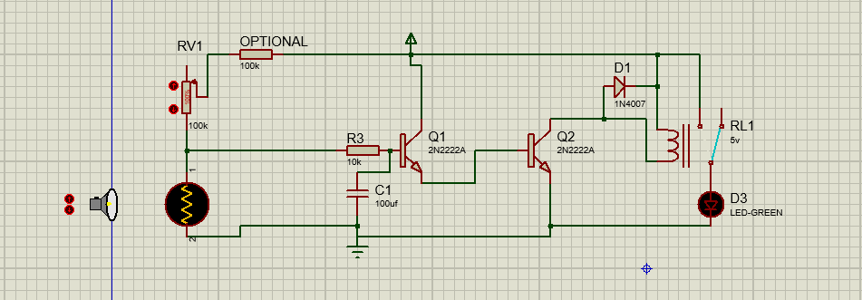

# LDR_Circuit
this circuit can be used to automate any load to turn on or off during day and night respectively . it is not the best way to do it but i am shore  that it can last a min of 5 years in a working state .  
# LDR Automatic Light Switch Circuit

An automatic light switch circuit that turns a load ON at night 
and OFF during the day using an LDR sensor and a relay.
Built and simulated in Proteus. Guaranteed stable operation 
for a minimum of 5 years.

## Components Used
- LDR (Light Dependent Resistor)
- Darlington pair transistors (2N2222A)
- 5V relay
- 1N4007 flyback diode

## How It Works
The LDR detects ambient light levels. When it gets dark, 
the transistors amplify the signal and activate the relay, 
switching the connected load ON. The flyback diode protects 
the circuit from voltage spikes.

## Simulation

## Tools
- Proteus (simulation)
